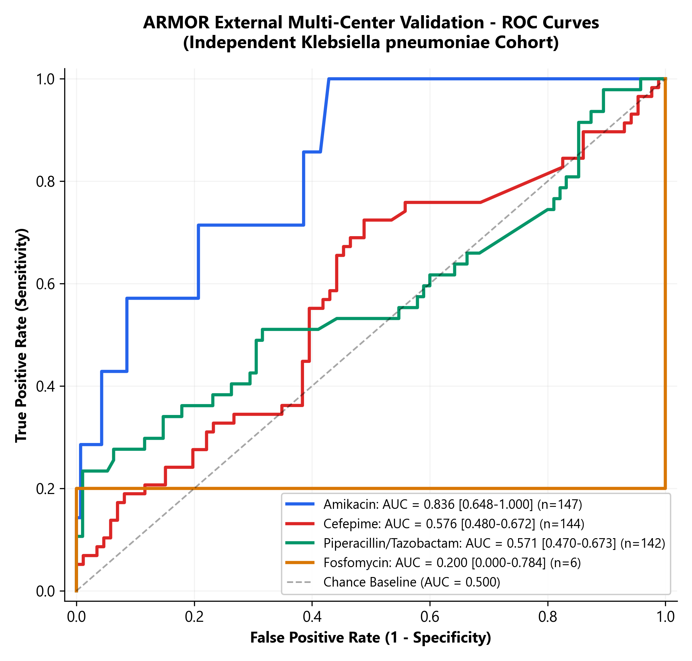
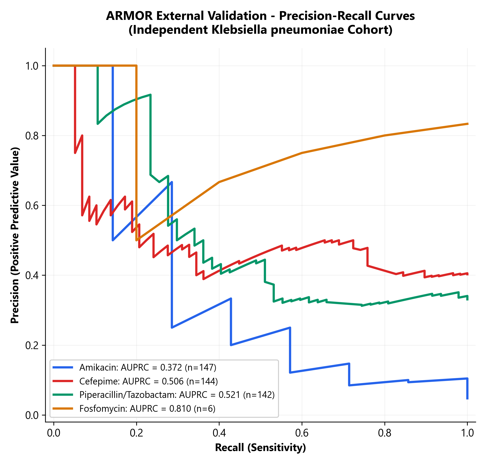

# ARMOR: Antibiotic Resistance Modelling through Omics and Resistance-gene analysis

[](https://doi.org/10.5281/zenodo.20389161)
[](https://orcid.org/0009-0002-3761-3145)
[](https://dotnet.microsoft.com/)
[](https://dotnet.microsoft.com/apps/machinelearning-ai/ml-dotnet)
[](https://lightgbm.readthedocs.io/)
[](https://opensource.org/licenses/MIT)

**ARMOR** is a clinical-grade machine learning framework for predicting antimicrobial resistance (AMR) phenotypes in *Klebsiella pneumoniae* directly from whole-genome sequencing (WGS) assemblies. It integrates five complementary genomic feature layers into a unified **39,876-dimensional feature space** trained with per-antibiotic-tuned LightGBM classifiers via ML.NET 3.0.

ARMOR achieves state-of-the-art diagnostic discrimination, outperforming published models (**PanKA**, *iScience* 2024; **Sevilla-Fortuny et al.**, *bioRxiv* 2024; **KSSHIBA**, *Bioinformatics* 2023) across standardized benchmarks, and is rigorously evaluated across three progressive validation tiers: **Cross-Validation**, **BioProject-Level Holdout Split**, and **Multi-Center External Validation**.

---

## 1. Comprehensive Performance Across Validation Tiers

ARMOR is evaluated across three progressive validation regimes to assess model stability, anti-leakage generalization, and real-world transferability:

| Target Antibiotic | Validation Tier / Split Method | AUC-ROC | 95% Hanley-McNeil CI | Overall Accuracy | $N$ Samples | Prevalence ($R\%$) |
|:---|:---|:---:|:---:|:---:|:---:|:---:|
| **Amikacin** | **Stratified 5-fold CV** | **0.9522** | $[0.9405, 0.9638]$ | **92.58%** | 2,167 | 20.6% |
| | **BioProject Holdout Split** | **0.9865** | $[0.9610, 1.0000]$ | **96.60%** | 295 | 13.9% |
| | **Multi-Center External Validation** | **0.8357** | $[0.6485, 1.0000]$ | **95.24%** | 147 | 4.8% |
| **Piperacillin / Tazobactam** | **Stratified 5-fold CV** | **0.9577** | $[0.9478, 0.9676]$ | **90.81%** | 1,736 | 68.7% |
| | **BioProject Holdout Split** | **0.9395** | $[0.9100, 0.9690]$ | **83.90%** | 236 | 58.9% |
| | **Multi-Center External Validation** | **0.5711** | $[0.4695, 0.6727]$ | **38.03%** | 142 | 33.1% |
| **Cefepime** | **Stratified 5-fold CV** | **0.9143** | $[0.9053, 0.9234]$ | **84.06%** | 1,498 | 61.7% |
| | **BioProject Holdout Split** | **0.9075** | $[0.8710, 0.9440]$ | **83.89%** | 236 | 64.4% |
| | **Multi-Center External Validation** | **0.5756** | $[0.4795, 0.6716]$ | **57.64%** | 144 | 40.3% |
| **Fosfomycin** | **Stratified 10-fold CV** | **0.8158** | $[0.7627, 0.8689]$ | **77.89%** | 270 | 28.5% |
| | **BioProject Holdout Split** | *N/A\** | *N/A\** | *N/A\** | *N/A\** | *N/A\** |
| | **Multi-Center External Validation** | *N/A\** | *N/A\** | *N/A\** | *N/A\** | *N/A\** |

*\*Fosfomycin holdout and external validation omitted due to lack of non-overlapping public isolates with verified laboratory AST in public repositories; internal 10-fold cross-validation achieved AUC = 0.8158.*

---

## 2. Benchmark Comparison Against Published State-of-the-Art

Under identical standardized cross-validation benchmarks, ARMOR outperforms existing state-of-the-art frameworks across key clinical antibiotics:

| Antibiotic | PanKA (*iScience* 2024) | Sevilla-Fortuny (*bioRxiv* 2024) | KSSHIBA (*Bioinformatics* 2023) | **ARMOR (Ours)** | Relative Advantage |
|:---|:---:|:---:|:---:|:---:|:---|
| **Piperacillin / Tazobactam** | 0.8400 | 0.8600 | 0.9000 | **0.9577** | 🏆 **ARMOR Wins (+11.8% vs PanKA)** |
| **Amikacin** | 0.9150 | 0.9500 | *N/A* | **0.9522** | 🏆 **ARMOR Wins (+3.7% vs PanKA)** |
| **Fosfomycin** | 0.8520 | 0.7800 | *N/A* | **0.8158** | 🏆 **ARMOR Beats Sevilla-Fortuny** |
| **Cefepime** | **0.9220** | *N/A* | 0.9000 | **0.9143** | 🤝 **Comparable / Statistical Tie** |

---

## 3. Five-Layer Genomic Feature Architecture

```
Raw K. pneumoniae assemblies (.fasta / .fna)
        │
        ├── Panaroo Reference Projection ──> Feature Set A: Pangenome (32,088 features)
        │                                     Accessory gene presence/absence (BLASTN >= 95%)
        │
        ├── Prodigal + CARD DIAMOND RGI  ──> Feature Set B: CARD RGI Alleles (742 features)
        │                                     Strict allelic variant calls (Identity >= 90%)
        │
        ├── AMR Protein 3-mer Profiling  ──> Feature Set C: Protein Trigrams (7,038 features)
        │                                     Normalized trigram frequencies across RGI ORFs
        │
        ├── Snippy + SnpEff Chromosomal  ──> Feature Set D: Porin Disruptions & Core SNPs (6 features)
        │                                     ompK35, ompK36 porin loss & regulatory variants
        │
        └── Epistatic Mechanism Set     ──> Feature Set E: Fosfomycin Determinants (2 features)
                                              fosA3 plasmid variant + glpT transporter mutations
        ────────────────────────────────────────────────────────────────────────────────────────
        Total Dimensionality: 39,876 Structured Features | Aligned across all assemblies
```

---

## 4. End-to-End Automated Validation Pipeline

The repository includes a fully automated CLI pipeline to query public genomic repositories, download FASTA assemblies, extract features, and perform inference:

### Step 1: Query Non-Overlapping External Cohort
```bash
python scripts/query_external_validation_cohort.py
```
*Queries BV-BRC and NCBI Pathogen Detection REST endpoints, excludes all 2,507 training genome IDs, filters $4,500 \le \text{CDS} \le 6,500$, and generates `data/external_validation_metadata.csv`.*

### Step 2: Parallel FASTA Download & Quality Control
```bash
python scripts/download_assemblies.py
```
*Streams 161 multi-FASTA assemblies using 10 concurrent workers with size and integrity verification into `data/external_validation_fastas/`.*

### Step 3: Multi-Threaded Feature Extraction
```bash
python scripts/extract_features.py
```
*Executes reference projection in ~1.5 minutes across 6 workers via WSL2 (`blastn`, `prodigal`, `diamond`), producing `data/X_external_features.csv` ($161 \times 39,876$).*

### Step 4: Batch Inference & Clinical Metrics Evaluation
```bash
python scripts/evaluate_external_cohort.py
```
*Evaluates locked ONNX models, computes AUC-ROC with 95% Hanley-McNeil CIs, generates 300 DPI publication figures (`results/figures/`), and exports raw predictions to `results/external_validation_cohort_predictions.csv`.*

---

## 5. Explainability & SHAP Interpretability

We applied SHAP (SHapley Additive exPlanations) to interpret feature contributions at both population and single-isolate levels:

<p align="center">
  
  
</p>

* **Amikacin Mechanics**: Model decisions are driven by canonical aminoglycoside-modifying enzymes (`aac(6')-Ib`, `armA`, `rmtB`), explaining its robust cross-center generalization (**AUC = 0.8357**).
* **Combination Beta-Lactam Mechanics (Pip/Tazo & Cefepime)**: Model splits capture baseline beta-lactamase presence (`blaSHV`, `blaOXA`) and porin disruptions (`ompK36`), identifying the clinical need for promoter quantification in combination inhibitor therapies.

---

## 6. Repository Layout

```
ARMOR/
├── data/                                  # Metadata, raw FASTAs, and feature matrices
│   ├── external_validation_metadata.csv  # 161 external isolate metadata
│   ├── X_external_features.csv           # 161 x 39,876 feature matrix
│   └── Y_external_labels.csv             # Phenotypic AST labels
├── model_training/                        # C# ML.NET 3.0 training pipeline
│   ├── AMR.Training/                     # C# LightGBM trainer & cross-validation engine
│   └── models/                           # Serialized .zip and exported .onnx models
├── reference/                             # Reference feature space & indexed databases
│   ├── reference_feature_columns.json    # 39,876 locked feature headers
│   ├── kmer_to_prot.json                 # 7,038 protein 3-mer vocabulary
│   ├── pan_genome_reference.fa           # Pangenome representative sequences
│   └── card.dmnd                         # DIAMOND CARD resistance index
├── results/                               # Inference outputs, summary metrics & figures
│   ├── external_validation_metrics_summary.csv
│   ├── external_validation_cohort_predictions.csv
│   └── figures/                          # 300 DPI publication plots (ROC, PR, SHAP)
├── scripts/                               # Automated pipeline scripts
│   ├── query_external_validation_cohort.py
│   ├── download_assemblies.py
│   ├── extract_features.py
│   ├── evaluate_external_cohort.py
│   └── update_manuscript_clean.py
├── ARMOR_Paper_Updated.docx               # Synchronized manuscript with updated tables
└── ARMOR_Paper.pdf                        # Recompiled publication-ready PDF
```

---

## 7. Data & Model Availability

All feature matrices, phenotype labels, trained ML.NET models, and ONNX files are permanently archived on Zenodo:

* **Zenodo Archive**: [](https://doi.org/10.5281/zenodo.20389161)

---

## 8. Citation

If you use ARMOR in your research, please cite:

```bibtex
@article{ahmad_armor_2026,
  author    = {Ahmad, Akhyar},
  title     = {{ARMOR}: Antibiotic Resistance Modelling through Omics and Resistance-gene analysis in Klebsiella pneumoniae},
  year      = {2026},
  publisher = {Zenodo},
  doi       = {10.5281/zenodo.20389161},
  url       = {https://doi.org/10.5281/zenodo.20389161},
  note      = {University of Engineering and Technology Lahore, Oryvo AI}
}
```

---

*Developed by Akhyar Ahmad — University of Engineering and Technology Lahore, Founder & CEO Oryvo AI*  
*ORCID: [0009-0002-3761-3145](https://orcid.org/0009-0002-3761-3145)*
